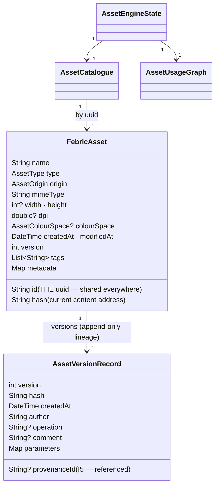
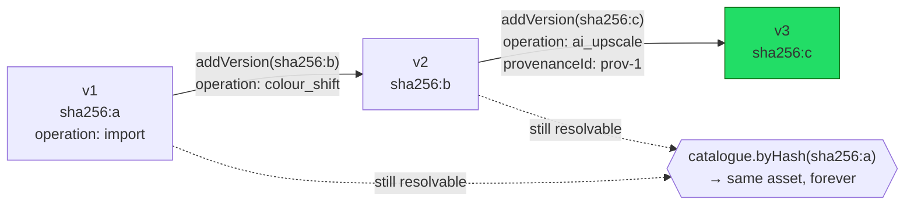
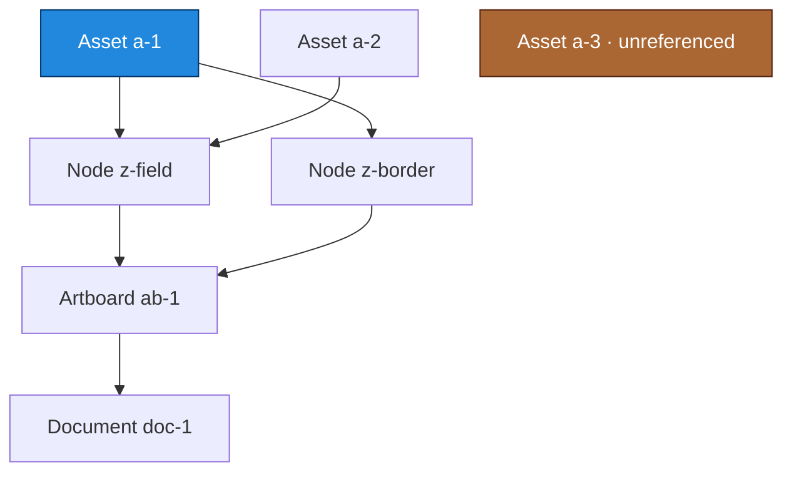
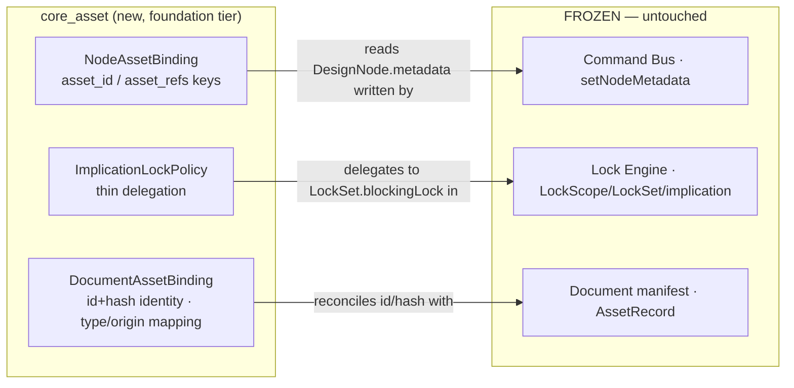

# FEBRIC Asset Engine (M4, ADR-0016)

The single source of truth for every external resource of a project.
Canvas renders assets, the tree references them, tools operate on them, AI
consumes them — **nothing owns bitmap data directly**. Built entirely on
the frozen M2/M3 architecture with zero modifications to it.

## Role in the system

```mermaid
graph TD
  subgraph consumers["Consumers (hold ids/hashes — never bytes)"]
    CANVAS[Canvas · renders by asset_id]
    TREE[Design Tree nodes · reference via setNodeMetadata]
    TOOLS[Tools · addVersion with operation+params]
    AIC[AI · consumes + produces versions with provenanceId]
    INTEL[core_assets · Asset Intelligence · reads to index]
  end
  consumers -->|uuid / hash| ENGINE

  subgraph ENGINE["AssetEngine (every mutation: Lock Engine FIRST · I4)"]
    LK[Lock check\nLockScope.object · LockPolicy] --> MUT[register · addVersion\namend · remove]
    MUT --> CAT[(AssetCatalogue\nsingle registry)]
    MUT --> GR[(AssetUsageGraph\nAsset→Node→Artboard→Document)]
  end
  CAT -->|hash| STORE[(AssetContentStore\ncontent-addressed · dedup · immutable)]
  ENGINE -->|AssetRejected\nreason + blocking lock| consumers

  ENGINE -.identity + hash.-> DOCBIND[DocumentAssetBinding]
  DOCBIND -.AssetRecord.id == FebricAsset.id.-> DOCMANIFEST[(Document manifest\nAssetRegistry · frozen M2)]
```

## Asset schema



## Immutable versioning — never overwrite



Content advances only by appending a version. Prior hashes never disappear;
`AssetCatalogue.byHash` resolves any historical version to its asset. The
current `(version, hash)` always equals `versions.last` — checked by
`FebricAsset.isLineageConsistent`.

## Dependency graph & reference counting



Every edge records the full **Asset → Node → Artboard → Document** chain,
so detection is a pure query:

| Query | Definition |
|---|---|
| **reference count** | edges for an asset id |
| **unused** | catalogue assets with zero references — safe to remove |
| **shared** | asset referenced by ≥2 distinct nodes (one asset, many nodes) |
| **duplicate** | distinct assets with identical *current* hash |
| **broken** | edge to an asset id the catalogue does not hold |

Removal is reference-counted: an in-use asset refuses deletion unless
`force`, and a forced delete leaves *detectable* broken references — never
silent ones.

## Integration seams (no modification to frozen engines)



- **Tree** references live in `DesignNode.metadata` under `asset_id` /
  `asset_refs`, written only via the existing `setNodeMetadata` command —
  no new commands, no schema change, undo/redo inherited.
- **Locks**: assets are `LockScope.object` targets; `ImplicationLockPolicy`
  delegates to the frozen `LockSet.blockingLock`, so project/document locks
  cover assets through the existing implication hierarchy.
- **Manifest**: `DocumentAssetBinding` keeps `AssetRecord.id ==
  FebricAsset.id` and shares the hash; precise type/origin ride the
  record's open metadata; coarse `AssetKind`/`AssetSource` derive by total
  frozen mappings that parse against the real enums.

## Dependency edges

```
core_asset → core_common   (Clock, IdGenerator seams)
core_asset → core_lock     (LockScope, LockSet, LockPolicy, LockState)
core_asset → core_textile  (DesignNode — tree binding walk)
core_asset → crypto        (sha256 content addressing)

core_asset ✗ core_document (foundation tier: never depends on it;
                            identity reconciled by pure wire-name math.
                            core_document is a dev-only dep for the
                            integration test suite.)
```

`core_asset` is pure Dart, foundation tier. Downstream, `core_assets`
(Asset Intelligence) and the rendering/canvas engines depend on it; it
depends on none of them.
