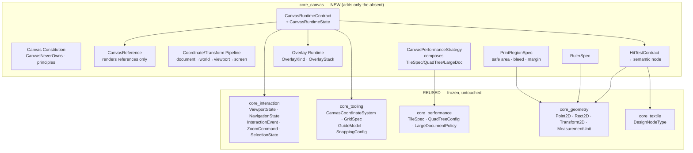
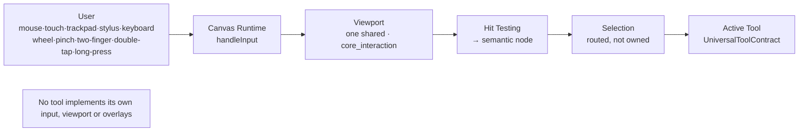
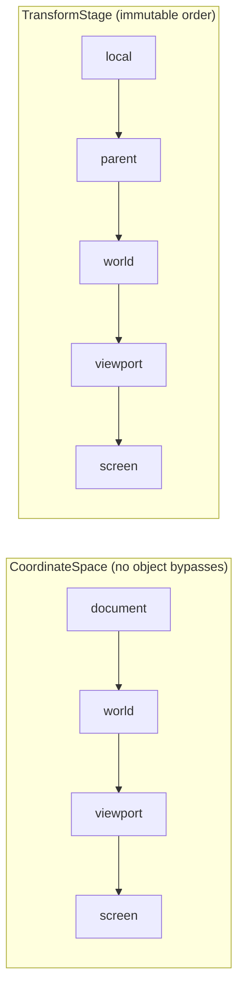

# FEBRIC Canvas Runtime (M5A, ADR-0018)

The frozen visual-runtime constitution of the FEBRIC OS. The Canvas is **not**
the source of truth: the Document owns data, the Semantic Tree owns meaning,
the Asset Engine owns resources. The Canvas visualises *references* to them and
is the single surface all on-canvas input flows through. Architecture only — no
rendering, no Flutter, no GPU, no painting, no business logic.

## Composition, not duplication

`core_canvas` composes the frozen foundations and adds only what did not exist.
Nothing frozen is modified.



## The Canvas Constitution

```mermaid
graph LR
  subgraph owns["Canvas OWNS (visual runtime state)"]
    V[viewport/camera ref]
    O[overlays]
    G[grid · guides · rulers]
    S[snap config]
    P[print regions]
    R[references (ids)]
  end
  subgraph never["Canvas NEVER OWNS (CanvasNeverOwns)"]
    D[Document] --- A[Assets] --- L[Layers] --- H[History]
    SE[Selection] --- PA[Patterns] --- M[Motifs] --- AI[AI] --- PL[Plugins]
  end
  owns -.holds references to.-> never
```

Canvas owns only visual runtime state; it renders references only; there is one
input pipeline and one shared viewport; AI never edits the canvas directly;
nothing bypasses the Canvas Runtime.

## Universal input & viewport pipeline



## Coordinate & transform pipeline



The transforms themselves are frozen in `core_geometry`/`core_interaction`;
`core_canvas` freezes only the named ordering.

## Frozen vocabularies (wire-name freeze, append-only)

| Vocabulary | Values |
|---|---|
| `CanvasNeverOwns` (9) | document, assets, layers, history, selection, patterns, motifs, ai, plugins |
| `CanvasReferenceKind` (3) | design_node, asset, layer |
| `CoordinateSpace` (4) | document, world, viewport, screen |
| `TransformStage` (5) | local, parent, world, viewport, screen |
| `HitTargetKind` (4) | node, guide, handle, empty |
| `OverlayKind` (12) | selection, hover, brush_cursor, polygon_preview, magic_wand_preview, ai_preview, measurement, grid, snap_guide, alignment_guide, ruler, tool_overlay |
| `PrintRegionKind` (3) | safe_area, bleed, print_margin |

## Deterministic behaviours (frozen)

- **Session restore.** `CanvasRuntimeState` (incl. the camera and its
  viewport, with `zoom`/`offset`/`rotation`/`devicePixelRatio`/sizes and view
  history) is fully `fromJson`/`toJson` — a serialise → restore reproduces the
  exact runtime, including the viewport, for future session restore.
- **Overlay paint order.** `OverlayStack` is kept in ascending
  `OverlayModel.order`, ties broken by ascending `OverlayModel.id`. Paint order
  is a pure function of the overlay set — contribution-sequence-independent and
  restore-stable.
- **Print-region unit strategy.** Insets are authored in a `MeasurementUnit`
  (pixel / mm / cm / inch; mm default, physical-unit-first) and convert via
  `PrintRegionSpec.insetsIn` / `CanvasInsets.convert`, delegating to the frozen
  `core_geometry.UnitConverter`. Pixel conversions take the surface DPI from
  `CanvasCoordinateSystem.dotsPerInch` (the single DPI source of truth).

## Dependency graph

```
core_canvas → { core_geometry, core_interaction, core_tooling,
                core_performance, core_textile }   (all pure Dart, acyclic)
core_canvas ✗ core_document / core_asset  (holds references/ids only)
```

`core_canvas` is pure Dart, foundation/integration tier; nothing frozen depends
back on it. Enforced by `tooling/dependency_lint.dart`.

## Acceptance criteria (verified)

- Pure Dart; immutable (freezed); JSON-serializable; SOLID; repository/DI-ready;
  no rendering, no Flutter, no GPU, no painting, no business logic; no TODO, no
  placeholder, no mock.
- Every requested M5A responsibility either **reuses** a frozen contract
  (viewport/camera/coordinate/transform/grid/guide/snap/performance/input) or is
  **added** without duplication (constitution, references, pipeline naming, hit
  testing to semantic nodes, overlays, rulers, print regions, runtime contract).
- Wire-name freezes pin every new vocabulary; `CanvasRuntimeContract` proven
  implementable end-to-end by a test double.
- Workspace: analyze `--fatal-infos` clean · format clean · dependency lint PASS
  · all package suites green (19 new `core_canvas` tests).
- **No frozen contract, invariant, or dependency edge changed.**

## Future integration notes

- **M5B (renderer)** implements `CanvasRuntimeContract`, `HitTestContract` and
  `OverlayRuntimeContract`; Flutter widgets, GPU and painting live there.
- Tools implement `UniversalToolContract` and consume the one Canvas Runtime;
  none re-implements input, viewport or overlays.
- AI stages proposals onto the command bus (I2); the canvas later visualises the
  applied result — it is never edited by AI directly.
