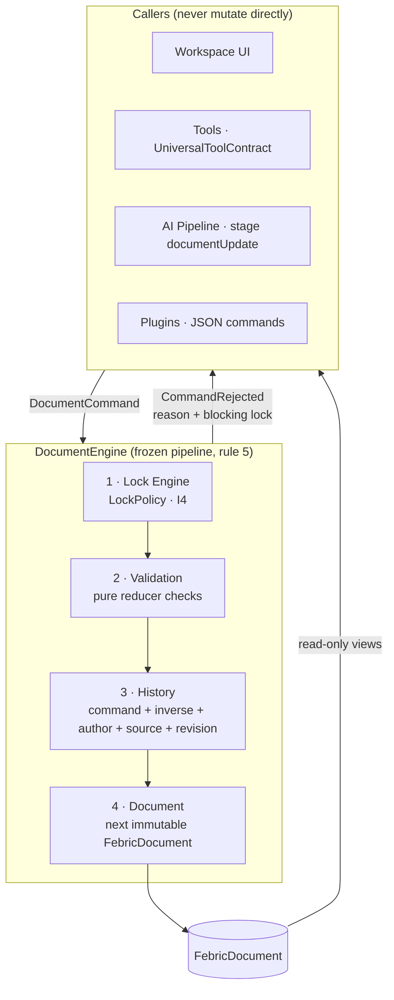
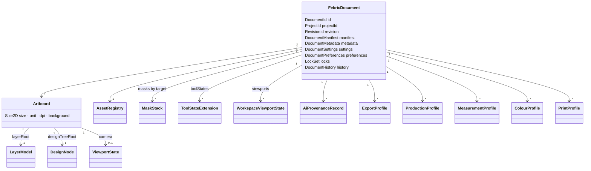
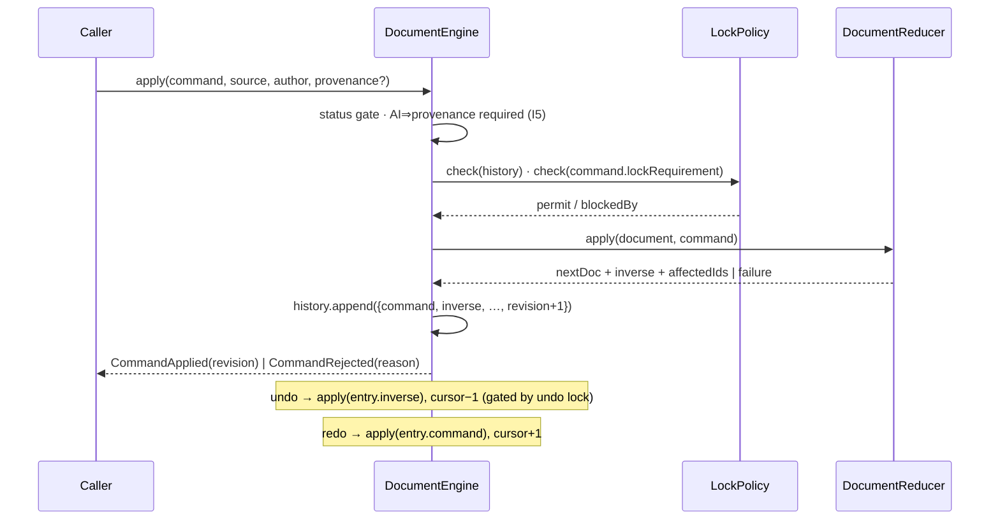
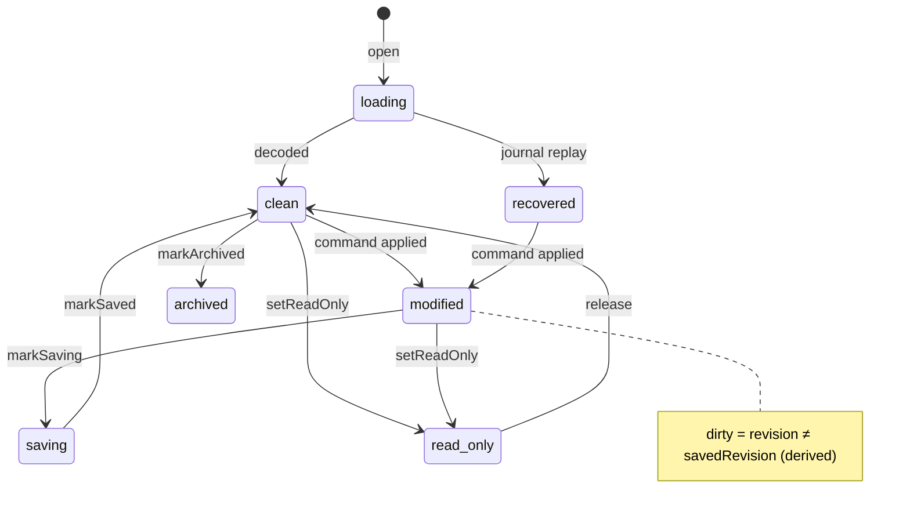

# FEBRIC Document Engine (M2, ADR-0014)

The runtime source of truth of the FEBRIC OS. Everything lives inside the
document; nothing edits it directly; every change is a typed command.

## Architecture

## Document schema

## Command flow & undo

## Lifecycle

## Dependency graph

`core_document → {core_common, core_geometry, core_textile, core_lock,
core_layer, core_mask, core_selection, core_interaction, core_ai}` — all
pure Dart, acyclic, lint-enforced. Consumers (M3+): design-tree feature,
tools, AI backbone, production.

## Acceptance criteria (verified by the 34-test suite)

Pipeline order unskippable · validation failures leave the document
untouched (`identical`) · targeted/global/history/undo locks gate exactly
per the frozen hierarchy with `blockedBy` surfaced · inverses restore
structure exactly (subtree delete/move/rename round-trips) · redo branch
truncation · AI commands refused without provenance, recorded with
revision + targets · tool states via envelopes only (unknown future tool
persists with zero schema change) · plugin namespaces isolated ·
viewport persistence round-trips · `.febric` lossless, newer-schema
refused, stepwise migration works · repository contract honoured.

## Migration & testing strategy

Schema is versioned from file one; migrations are registered stepwise and
exercised in CI with forged legacy payloads. New model fields must default
(decode of older JSON succeeds); removals/renames require a migration + a
freeze-test update + an ADR. Every engine behaviour is unit-tested with
deterministic seams (FixedClock, SequentialIdGenerator); integration with
rendering/UI arrives in later milestones against this frozen surface.
