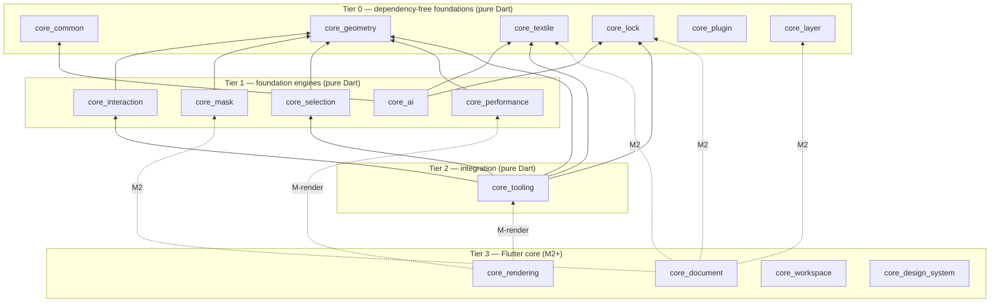
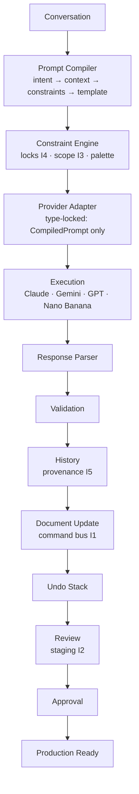

# FEBRIC — M1.6 Foundation Freeze

**Status: FROZEN** (ADR-0004…0013, 2026-07-07). Everything built after this
point — the Document Engine (M2), every tool, every AI capability, every
plugin — inherits these contracts. Nothing bypasses them. Amendments
require a superseding ADR; every vocabulary is pinned by wire-name freeze
tests that fail CI on drift.

## 1. The ten frozen engines

| # | Engine | Package | ADR | Frozen surface |
|---|---|---|---|---|
| 1 | Lock Engine | `core_lock` | 0005 | 16 `LockScope`s + implication hierarchy, `LockState`/`LockSet`, `LockDecision`, `LockPolicy` |
| 2 | Layer Engine | `core_layer` | 0006 | 12 `LayerKind`s, 16 `FebricBlendMode`s, immutable `LayerModel` (UUID, hierarchy, flags, tags, metadata, maskIds) |
| 3 | Mask Engine | `core_mask` | 0007 | 6 `MaskKind`s, 4 boolean ops, 4 refinements, `MaskModel`, ordered `MaskStack` |
| 4 | Selection Engine | `core_selection` | 0008 | 10 `SelectionShapeKind`s, 4 refinements, `SelectionRegion`/`Snapshot` (UUID), bounded `SelectionHistory` |
| 5 | Prompt Compiler | `core_ai/src/prompt` | 0009 | 10-stage pipeline, typed stage interfaces, `CompiledPrompt`, providers: Claude · Gemini · GPT · Nano Banana |
| 6 | Plugin SDK | `core_plugin` | 0010 | `PluginManifest`/`SemVer`, 7 permissions (elevated flag), 8 lifecycle states, 2 sandboxes, registry/host/security interfaces |
| 7 | Performance Strategy | `core_performance` | 0011 | Tiles, spatial index/QuadTree, cache tiers/budgets, pools, worker priorities, history compression, large-doc policy + strategy doc |
| 8 | Universal Tool Contract | `core_tooling` | 0012 | Exactly 14 members; support models bound to `FebricTool` |
| 9 | Universal Canvas Contract | `core_tooling` | 0012 | Viewport/camera/coords/selections/locks/history/gestures/zoom/pan/rotation/snapping/guides/grid/transform/measurement |
| 10 | Universal AI Pipeline | `core_ai/src/pipeline` | 0013 | 13 stages, `AiPipelineRun` with unskippable ordering |

Plus the enabling extraction: **`core_geometry`** (Point2D, Size2D, Rect2D,
Transform2D, MeasurementUnit/UnitConverter) — moved out of
`core_interaction`, which now re-exports it (public API unchanged).

## 2. Package graph (mermaid)

## 3. Universal AI Pipeline (mermaid)

## 4. Dependency rules (CI-enforced by `tooling/dependency_lint.dart`)

1. `app → features → core → nothing`; features never import features.
2. Pure-Dart set now includes every M1.6 package — no Flutter imports.
3. Dependency-free tier: `core_common`, `core_geometry`, `core_textile`,
   `core_lock`, `core_plugin`, `core_layer` — zero internal deps, forever.
4. `core_tooling` is the only foundation package composing multiple
   foundations; nothing composes it back (acyclic — no circular deps).
5. Token discipline (colors), wire-name freezes, and the 14-member tool
   contract are all regression-tested.

## 5. Public API surface (per package barrel)

Only barrels are public; `src/` is implementation-private
(`implementation_imports` lint). Every model is freezed + JSON with
snake_case wire names; every enum exposes `wireName`, `label`,
`fromWireName` (throws on unknown input — corrupt data fails loudly).

## 6. Migration notes

- **Geometry extraction**: `core_interaction` re-exports `core_geometry`;
  zero source changes were needed in dependents (verified by its untouched
  47-test suite). New code should import `core_geometry` directly.
- **`core_ai`** gained freezed/json + `core_lock`/`core_textile` deps; its
  existing package marker and blueprint subfolders are untouched.
- No other package changed behaviour; M0/M1/M1.5 test suites run unchanged.

## 7. Acceptance criteria (all verified)

- Every engine: pure Dart, immutable (freezed), JSON-serializable,
  fully documented, zero TODO/placeholder/mock/UI/business logic.
- Wire-name freeze tests pin every vocabulary; hierarchy/order semantics
  (lock implication, pipeline ordering, selection history) are unit-tested.
- The 14-member tool contract is proven implementable end-to-end by a
  reference test double (`tooling_contracts_test.dart`).
- Workspace: analyze clean (`--fatal-infos`), dependency lint PASS,
  all package suites green, debug APK builds.

## 8. Testing strategy

- **Freeze tests** guard serialized contracts (append-only vocabularies).
- **Semantic tests** guard behaviourally frozen rules (lock implication
  closure, unskippable pipeline order, bounded histories, semver
  compatibility, unit conversion).
- **Contract implementability tests** prove interfaces are complete enough
  to implement (tool contract test double).
- **Integration tests arrive with implementations** (M2+): command-bus lock
  gating, staging flows, renderer tiling — each implementation milestone
  must add conformance tests against these frozen contracts.

## 9. Future integration notes

- **M2 `core_document`** consumes textile (DesignNode), lock (command
  gating), layer (compositing binding), mask/selection (region scoping)
  and performance (history compression). It implements `LockPolicy` and
  the command bus; it defines no new lock/layer/mask vocabulary.
- **Tool milestones** implement `UniversalToolContract` per frozen
  `FebricTool`; the workspace hosts them via `UniversalCanvasContract`.
- **AI backbone (M6)** implements the stage interfaces and provider
  adapters; the API Manager routes by `AiCapability`.
- **Plugin milestone** implements registry/host/sandbox against ADR-0010.
